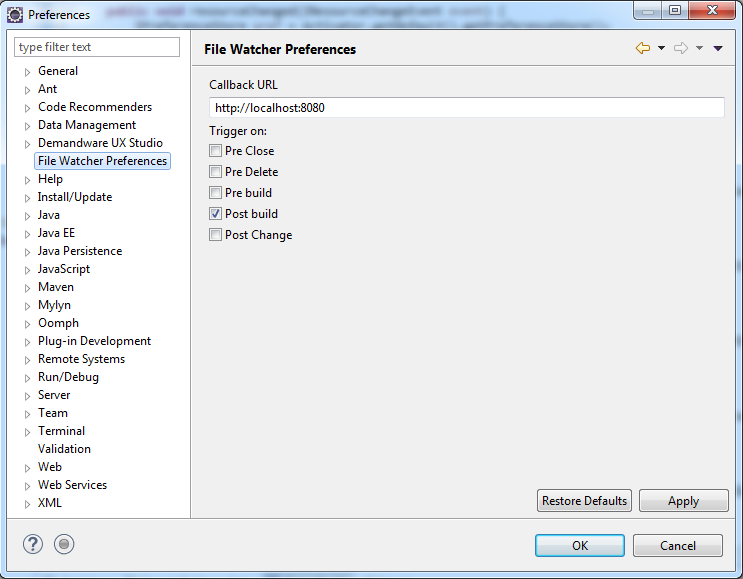

# Eclipse File Watcher
> An eclipse plugin that will send HTTP GET requests to a specified location
when a resource is updated.

## Configuration
To configure the plugin you need to go to
Window -> Preferences -> File Watcher Preferences

## Events
Example URL calls:  

- http://localhost:8080/?action=postbuild&path=%2Ftest%2Fcartridge%2Fscripts%2Ftest.ds
- http://localhost:8080/?action=prebuild&path=%2Ftest%2Fcartridge%2Fscripts%2Ftest.ds
- http://localhost:8080/?action=postchange&path=%2Ftest%2Fcartridge%2Fscripts%2Ftest.ds

All available events: 

- preclose
- predelete
- postchange
- prebuild
- postbuild

### Installation

1. Download the latest release from [here](../../releases)
2. Add the `.jar` file in your `eclipse/plugins` directory.
3. Restart eclipse

### Author

Mihai Ionut Vilcu
 
+ [github/ionutvmi](https://github.com/ionutvmi)
+ [twitter/ionutvmi](http://twitter.com/ionutvmi) 

### License
Copyright (c) 2015 Mihai Ionut Vilcu   
Released under the MIT license

